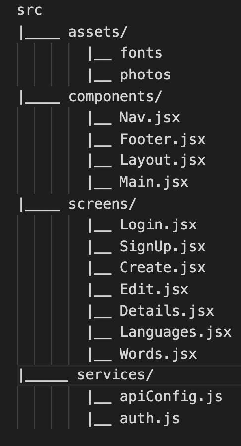

# LinguaFile

## Overview

#### Description
Derived from the word "linguaphile" which is a person who loves learning or studying languages, LinguaFile is an app for where people with that passion can come and hone their linguistic chops by creating personalized flash cards of words in the languages they're learning to help them expand their vocabulary in their target language(s).
#### Features
- LinguaFile will allow users to sign up and create their own profile so they can begin curating their own study guide of words
- Users will be able to choose from a variety of languages and begin creating a personalized list of flashcards of words they're struggling to commit to memory or simply words they're fond of in their new language
- The flashcards will contain the language the word comes from, its definition, its part of speech, an exmaple sentence, as well as a picture that will help the user remember the word
- LinguaFile will contain links to external resources to help them keep learning
#### Goals
- Make the "flash cards" as information dense and visually appealing as possible as to help the user retain the words.
- Allow users to test themselves by having the definition of the word hidden until the word is clicked.
- Allow users to sort their list by word type and by language.
#### Challenges
- Getting the back end on Rails set up will probably be an obstacle as I'm not completely solid on everything yet. Will probably have to reference the repos freuently.
- I want to have the flash cards appear as modals and I've never worked with those before so that could pose a challenge
- Connecting my site to cloudinary to allow users to upload images
## Libraries and Dependencies

| Library | Description |
|---------|-------------|
|Axios    |make api calls to fetch data|
|React    |used on create the front-end|
|React-Router|client-side routing      |
|React-Router-Dom |Dynamic-Routing     |
|bcrypt   |back-end authentication|
|cors     |lets back-end and front-end run together|
|cloudinary|let users host images on front-end|
## Client (Front End)

#### Wireframe
<https://www.figma.com/file/lSHkIJRdOBZSU18MYrHB2w/LinguaFile?node-id=0%3A1>

#### Component Tree
<https://whimsical.com/linguafile-4mB6qsCFoeqfKcQG8FFy5b>

#### Component Architecture
[H]

#### Time Estimates
|Task            |Priority|Est. Time    |Real Time    |
|----------------|--------|-------------|-------------|
|Set up models   |  H     |    1hr      |             |
|Add seed data   |  H     |    1hr      |             |
|Set up schema   |  H     |    .5hr     |             |
|Set up controllers| H    |     1hr     |             |
|Set up routes   |   H    |     1hr     |             |
|Set up auth     |   H    |     2hr     |             |
|Test routes/auth|   H    |     1.5hr   |             |
|Create client   |   H    |     .5hr    |             |
|Create forms    |   H    |     3hr     |             |
|Create main     |  H     |     2hr     |             |
|Create language screen|H |     2hr     |             |
|Create Word screen|   H  |     2hr     |             |
|Word details    |  H     |     2hr     |             |
|Layout          |  H     |     2hr     |             |
|Modals          | M      |     1.5hr   |             |
|Sorting         | M      |     2hr     |             |
|Test front-end  |  H     |     2hr     |             |
|Styling         | H      |    8 hr     |             |
Total            |        |    35hr     |             |

## Server (Back End)

#### ERD Model
<https://app.diagrams.net/#G1Ej1_38T2I5R5mzi-1w5TzyBTskSltBaX>

## Post-MVP

- Add sound bytes for pronunctiation
- Develop a quiz for studying

